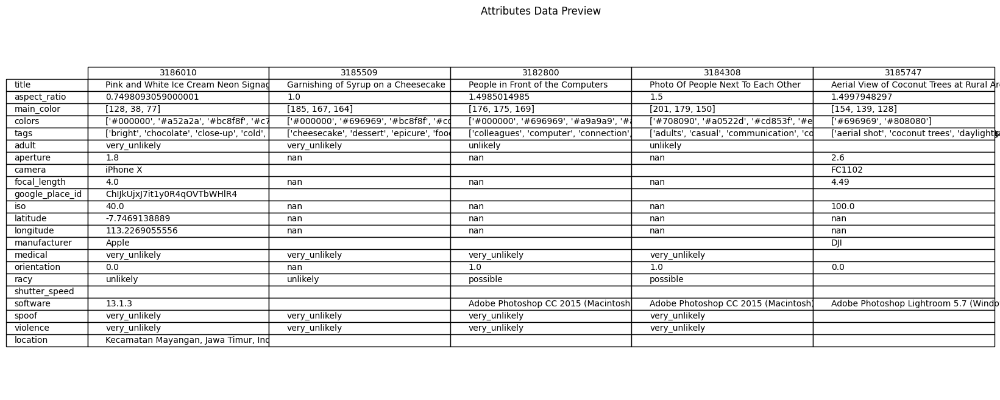
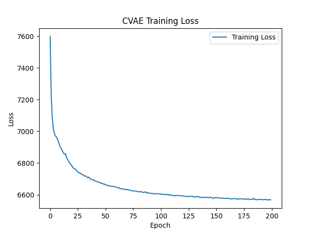

# Visualizing Vibes: Abstract Aesthetic Image Generation from Mood + Color Using a Conditional VAE

---

## Overview

**MoodBoard Generator** is an AI-powered image generation tool that creates **abstract aesthetic visuals** based on two simple inputs: a **mood** (e.g., "dreamy", "romantic") and a **color theme** (e.g., "blue", "red"). Instead of producing photorealistic scenes, it generates **blurred, emotional color textures**, like visual vibes, that reflect how a specific mood-color pairing might *feel*.

This project was designed for creators, designers, and moodboard lovers who want to **visually represent an emotional tone** or build aesthetic content foundations.

---

## What This Project Actually Does

This project trains a Conditional Variational Autoencoder (CVAE) to generate **blurred, abstract aesthetic images** from combinations of mood and color labels. It does not aim to generate realistic scenes or objects. Instead, each image represents an emotional impression — a visual "vibe" — derived from ~12,000 aesthetic photographs from Pexels.


### What you get:
- 64x64 RGB image "moodscapes"
- Soft gradients and abstract color compositions
- Unique results for each mood-color combination

---

## What You Can Use This For
* Moodboard builders for designers and creatives
* Branding explorations
* Generative design palette development
* Emotion-based generative art
* Lightweight aesthetic AI tools

---

---

## Exploratory Data Analysis (EDA)

This section highlights the visual and statistical analysis of the Pexels 110k aesthetic dataset to understand its structure, color dynamics, and metadata distribution.

This image shows a preview of the structured metadata extracted from `attributes_df.json`:



---

This image shows the brightness distribution across all images in the dataset:


---

This image shows the size and aspect ratio distribution across images:


---

These images shows an example of the top 3 dominant colors extracted from a randomly selected image using KMeans clustering:


---

This image shows the 20 most common visual tags applied across the dataset:


---

This image shows how the images were grouped by visual similarity based on extracted feature vectors:


---

## Model Architecture

- **Model Type**: Conditional Variational Autoencoder (CVAE)
- **Conditioning**: Dual (one-hot encoded mood + color)
- **Latent Dimension**: 64
- **Image Size**: 64 x 64 x 3 (RGB)
- **Input Vector**: Concatenation of flattened image and condition vector (12288 + 16)
- **Loss Function**: CVAE loss (reconstruction + KL divergence)
- **Training Epochs**: Up to 200
- **Progress Images**: Generated every 25 epochs during training to show evolution

---

## Folder Structure
```
├── configs/
│   └── config.yaml                     # Model and training configuration
├── data/
│   ├── filtered_images/               # Preprocessed image patches
│   ├── filtered_mood_color_dataset.csv # Image labels (mood + color)
├── model/
│   └── cvae.py                         # CVAE architecture
├── outputs/
│   ├── checkpoints/                    # Saved trained models (.pth)
│   └── generated/                      # Generated image outputs
├── scripts/
│   ├── train_cvae.py                   # CVAE training script
│   └── generate.py                     # Image generation script (from terminal)
├── utils/
│   ├── data_utils.py                   # Custom dataset class
│   └── train_utils.py                  # Losses, plots, and saving
├── gui.py                              # GUI definition
├── run_gui.sh                          # Launch script for GUI
├── setup_env.sh                        # Conda environment setup
├── train_cvae.sh                       # SLURM script to train (optional)
├── requirements.txt                    # All required Python packages
```

---

## Accessing and Running on Quest
* Users will not need to retrain the model. All evaluation will be done using the pre-trained model checkpoint and GUI.

### 1. Log into Quest
```bash
ssh -X your_netid@login.quest.northwestern.edu
```

### 2. Clone the Repo into Quest
```bash
git clone https://github.com/hanna8008/aesthetic_moodboard_generation.git
```
```bash
cd aesthetic_moodboard_generation
```

### 3. Setup the Conda Environment (First Time Only)
```bash
bash setup_env.sh
```

This will:
* Create a Conda Environment called 'moodgen'
* Install all required packages from 'requirements.txt'

### 4. Activate the Moodgen Environment
```bash
conda activate moodgen
```

### 5. Run the GUI
```bash
bash run_gui.sh
```

This will:
* Activate the 'moodgen' Environment
* Launch 'gui.py' with dropdown menus for mood and color
* Display the generated image in a pop-up window

> Make sure you're on a login node with GUI support and have used 'ssh -X'

### 5a. Access GUI online via "Open Browser" button in Quest 
```bash
Lower right hand corner, click "Open in Browser" button
```

---

## Extra Criteria - GUI Overview

The GUI is built using [Gradio](https://www.gradio.app/) and allows users to interactively generate aesthetic images based on mood and color labels.

### Features:
- **Dropdown Menus**: Select one of eight moods and eight color themes
- **Generate Button**: Calls the backend script (`scripts/generate.py`) with the selected mood and color
- **Output Preview**: Displays the generated image in real-time (although small, you can download it)
- **Gradio UI**: Lightweight, web-based interface with soft, aesthetic styling

### How It Works:
1. User selects a mood (e.g., `dreamy`) and a color (e.g., `blue`)
2. Gradio calls the function `generate_and_return_image()`, which runs:
   ```bash
   python scripts/generate.py --mood dreamy --color blue
   ```
---

## Training Progress Examples

This image shows how the generator improves over training epochs (mood: *dreamy*, color: *blue*):


This image shows how the generator improves over training epochs (mood: *romantic*, color: *red*):


This image shows how the generator improves over training epochs (mood: *natural*, color: *green*):


---

## Training Loss Graph: Epochs = 200

The plot below illustrates the decrease in total CVAE training loss over 200 epochs. A sharp decline early in training is followed by gradual convergence, indicating that the model is learning stable latent representations and improving reconstruction quality over time.



---

## Data Preparation & Transfer

### Step 1: Filtering and Labeling

The raw dataset (`pexels-110k-512p-min-jpg`) was filtered using `import_load_eda_data.ipynb` and `auto_label_mood_color.py`. These scripts:

- Parsed image metadata from `attributes_df.json`
- Matched visual tags to predefined **mood** and **color** keyword dictionaries
- Saved the filtered results as:
  - `data/filtered_mood_color_dataset.csv` — labeled metadata
  - `data/filtered_images/` — images matching mood/color keywords

### Step 2: Uploading to Quest (HPC)

After preprocessing locally, the filtered dataset was transferred to Quest using `scp`:

```bash
# Upload the labeled CSV
scp data/filtered_mood_color_dataset.csv <netid>@quest.it.northwestern.edu:/path/to/project/data/

# Upload the filtered image folder
scp -r data/filtered_images/ <netid>@quest.it.northwestern.edu:/path/to/project/data/
```

---

## Model Training on Quest (Northwestern Quest)

Training was performed on Quest using a 3D CVAE model

### Setup Steps

1. **Uploaded project files to Quest**, including:
   - `scripts/train_cvae.py` (training logic)
   - `configs/config.yaml` (training parameters)
   - Filtered data: `data/filtered_mood_color_dataset.csv` and `data/filtered_images/`

2. **Activated Conda environment** on Quest:

```bash
module purge
module load anaconda3
source $(conda info --base)/etc/profile.d/conda.sh
conda activate moodgen
```

3. **Submitted a training job using shell script**:

```bash
bash train_cvae.sh
```

### Outputs Saved To:
* `outputs/checkpoints/` — saved model checkpoints (e.g., cvae_dual_epoch_200.pth)
* `outputs/generated/` — progress images at various training epochs
* `outputs/logs/` — training loss visualizations

---

## Future Improvements
* Support for caption-based conditioning (e.g., "lavender sunset")
* Higher resolution outputs (128x128 or 256x256)
* Diffusion model variant

---

## Additional Notes:
* Trained model is saved in 'outputs/checkpoints/cvae.pth'
* GUI output images are saved in 'outputs/generated/'
* If display issues arise, ensure your terminal supports X11

---

## Image Source: ##
### Title: Pexels 110k 512p JPEG ###
https://www.kaggle.com/datasets/innominate817/pexels-110k-512p-min-jpg

---

## References and Tools Used:
1. [Pexels 110k Dataset (Kaggle)](https://www.kaggle.com/datasets/innominate817/pexels-110k-512p-min-jpg)
2. [CVAE baseline structure](https://github.com/unnir/cVAE)
3. Northwestern’s EECS Autoencoders Lecture by Dr. D'Arcy
4. [PyTorch Dataset Dataloader Guide (Kaggle)](https://www.kaggle.com/code/pinocookie/pytorch-dataset-and-dataloader)
5. [Conditional VAE From Scratch - Medium](https://medium.com/@sofeikov/implementing-conditional-variational-auto-encoders-cvae-from-scratch-29fcbb8cb08f)